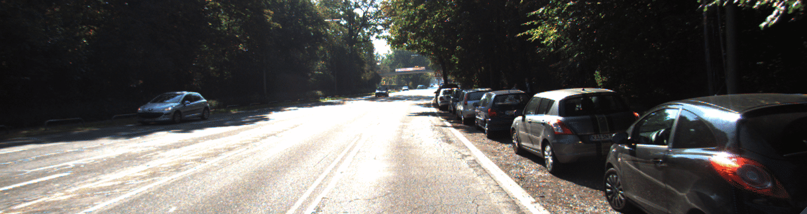
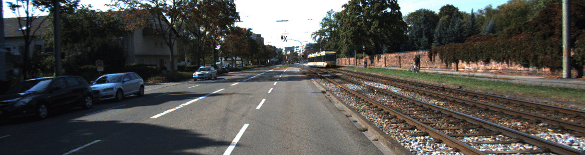
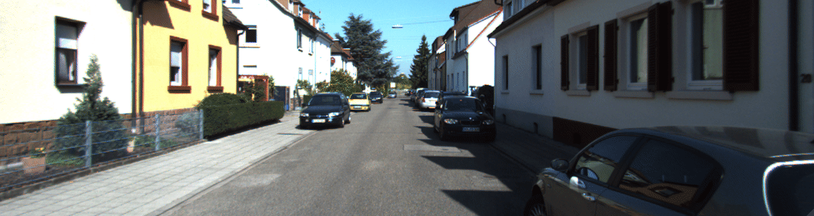

# Project Defude

<p align="center">
	
	
	
</p>

*Synthetic Defocusing using Monocular Depth Estimation*

Graded blurring of an image based on how far a point is from focus using just a single image with no extra data.
To achieve this we generate a depth map for the image using machine learning.
Create blurred versions of the image in levels based on how far a point is from the depth of focus.
Stitch the different blurred images to create the final image with the selected point fully focussed and points further away become more blurred.

## How to run
You'll need to setup Tensorflow v1 and OpenCV for the bare minimum run.

Install a trained model for depth estimation.
```sh
sh ./depth/get_model.sh model_kitti depth/
```
This will download the model which will give the best results for the sample in the repo.

Call main.py with model path and image path
```sh
python main.py --model_path /path/to/model --image_path /path/to/image
```

The image will load up. Clicking anywhere sets that as the point of focus, regenerating the image.

*I've actually pushed in the depth data for the sample images, so you can actually run the program without tensorflow or a trained model for the sample images :)*


### To use our nice GUI
Install dependencies from requirements.txt

Run the gui version as
```sh
python gui.py --model_path /path/to/model
```
Gui version requires some additional packages. Install as necessary.

## Depth Estimation
We have used the method based on the paper Unsupervised Monocular Depth Estimation with Left-Right Consistency. You can find more about their amazing paper [here](http://visual.cs.ucl.ac.uk/pubs/monoDepth/).
They train a machine learning model to generate a depth map using just a single image.

### How the machine learing model is trained in simple terms:
The model is trained on a large set of stereo(left-right) images to generate a right image from a given left image.
Generating the right image, the model is learning internally about the depth of various points in the image.

Once the model is trained. We can give it a simple image and it will be able to generate a depth map for that image.

You can learn more about their amazing project on [github](https://github.com/mrharicot/monodepth).
Their trained models give way better results than what we can so we are using that.
The depth estimation code we have is a minimal stripped down version just to run the model.


## The Team
This was done as a final year project by [Haritha Paul](https://github.com/haritha1997), [Navin Mohan](https://github.com/navin-mohan), [Roshan V](https://github.com/ros-han) and me.

Leave a star if you liked the project. :)
